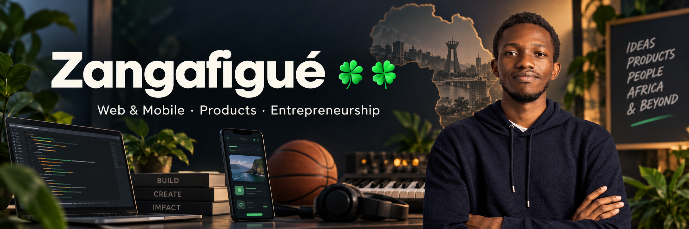

  

  <strong>Web & Mobile Developer · Computer Science Student & Builder</strong> 
  From Burkina Faso · currently in Lomé, Togo

I am a Computer Science student at Burkina Institute of Technology. I build web and mobile products from practical problems, paying particular attention to constrained connectivity, modest devices and the realities of West Africa.

  <a href="https://portfolio-zangafigue.vercel.app">Portfolio</a> ·
  <a href="https://linktr.ee/zangafigue">Linktree</a> ·
  <a href="mailto:mathiastraore08@gmail.com">Email</a>

## What I am working on now

- Completing a web and mobile development internship at **WoeLab / HubCity Africa** in Lomé.
- Building [**Démotivateur**](https://github.com/Zangafigue/demotivateur) in public: an adaptive, consent-based confrontation agent exploring how words can lead to measurable action.
- Running a 30-day experiment around consistent publishing and product progress.
- Deepening my Flutter and product-engineering practice while continuing to learn NestJS and Next.js through project work.

## Selected work

| Project | What it is | My work and stack |
|---|---|---|
| [**Zamsma**](https://github.com/Zangafigue/Valence) | **In development.** An offline-first narrative chemistry puzzle game for secondary-school students in Burkina Faso, developed with Team Mirror for the Hackathon des Grandes Écoles 2026. | Team lead and main contributor · Flutter · BLoC · Hive · Django REST Framework · PostgreSQL |
| **AgroConnect BF** — [Web](https://github.com/Zangafigue/agroconnect-web) · [API](https://github.com/Zangafigue/agroconnect-backend) · [Mobile](https://github.com/Zangafigue/agroconnect-mobile) | **In development.** A team-built agricultural platform connecting farmers, buyers and transporters across web and mobile experiences. | Lead developer · React · TypeScript · Node.js · Express · MongoDB · Flutter |
| [**CV Builder**](https://github.com/Zangafigue/cv-builder) · [Live](https://cv-builder-three-tau.vercel.app) | A guided CV builder with 14 templates, PDF/DOCX import, ATS-oriented exports, and AI-assisted analysis and translation. | Product design and development · React 19 · Vite · Gemini · Vitest |
| [**Izwan**](https://github.com/Kodek-10/Izwan) | A collaborative AI-assisted knowledge and snippet manager spanning web, desktop and a VS Code extension. | Contributor in a two-person academic team · FastAPI · React · TypeScript · Electron · VS Code API |
| [**GymX v2**](https://github.com/Zangafigue/GymX-v2) · [Live](https://gym-x-v2.vercel.app) | A localized gym-management product with authentication, role-based portals, class booking and administrative workflows. | Product design and development · React 19 · TypeScript · Supabase · Tailwind CSS |

## Current experiment

### [Démotivateur](https://github.com/Zangafigue/demotivateur)

Most personal-development products assume that encouragement works for everyone. Démotivateur explores another approach: a consent-based agent that studies its user, adapts its form of confrontation and measures whether words actually lead to action.

The project is currently in public discovery and experimentation. A browser-based onboarding prototype is available while the mobile architecture is still being evaluated. Its first test combines a daily publishing commitment with continuous progress on the agent itself.

## What I work with

- **Web:** React, TypeScript, JavaScript, Next.js, Vue.js and Tailwind CSS.
- **Mobile:** Flutter and Dart, including offline-first application patterns.
- **Backend:** Node.js, Express, Django REST Framework and Flask; currently consolidating NestJS through project work.
- **Data:** PostgreSQL, Supabase, MongoDB and MySQL.
- **Product and tooling:** Git, GitHub, Docker, Figma and interface prototyping.

These are working tools, not a badge collection. The projects above show where and how I have used them.

## Beyond the code

I do more than write code: I design interfaces, explore product ideas and learn about entrepreneurship.

Away from the screen, you will often find me on a basketball court or singing with a choir. I am also learning djembe, drums and piano while experimenting with beatmaking, remixes and DJing.

## Learning and credentials

- [Introduction to Critical Infrastructure Protection](https://learn.opswatacademy.com/certificate/Has9N3vTog) — OPSWAT Academy.
- [Model Context Protocol](https://verify.skilljar.com/c/ymspxpbpy73v) and [AI Fluency](https://verify.skilljar.com/c/r7eogtkxka2p) — Anthropic Academy.
- [Foundations of Project Management](https://coursera.org/verify/NOFNOQ5KE62P) and [Project Initiation](https://coursera.org/verify/HUZBGS7FX8SN) — Google / Coursera.

## Let us connect

I am interested in web and mobile products, practical AI, developer tools, education and technology designed for African contexts.

[Portfolio](https://portfolio-zangafigue.vercel.app) · [All my links](https://linktr.ee/zangafigue) · [Email](mailto:mathiastraore08@gmail.com)

*Building with curiosity, rhythm and a lot of luck.* 🍀🍀
